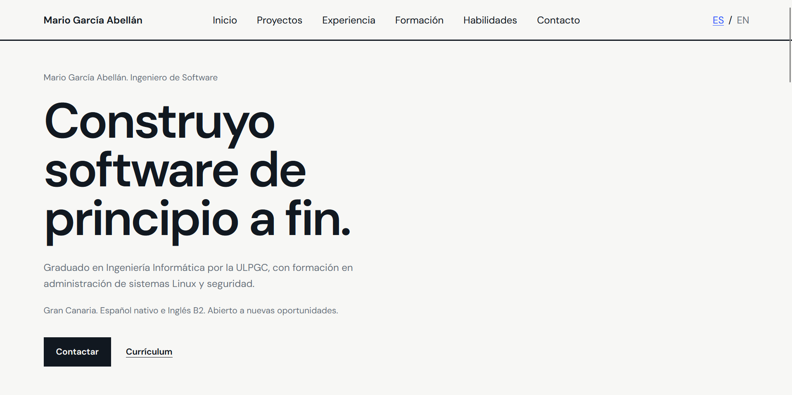

# Portfolio

Portfolio con diseño minimalista en el que muestro algunos proyectos destacados, mi formación, certificaciones y demás información relevante. Desplegado automáticamente con Actions en GitHub Pages: https://mario-grc.github.io/portfolio/



Está desarrollado con [Angular](https://angular.io/) y se ha diseñado para ser responsive. Se ha organizado en componentes independientes para el header, presentación, proyectos, experiencia, formación, habilidades, contacto y pie de página, facilitando la mantenibilidad y expansión del proyecto. Además, implementa un sistema ligero de traducción propio con Angular Signals que permite cambiar entre español e inglés en tiempo real, sin dependencias externas.

## Ejecución en local

### Requisitos

- Node.js 20 o superior
- npm 11 o superior

### Instalación

```bash
git clone https://github.com/Mario-Grc/portfolio.git
cd portfolio
npm install
```

### Servidor de desarrollo

```bash
npm start
```

También puedes ejecutarlo directamente con Angular CLI:

```bash
ng serve
```

Después, abre [http://localhost:4200/](http://localhost:4200/) en el navegador. La aplicación se recarga automáticamente al modificar el código.

### Otros comandos

```bash
npm test
npm run build
```

Sus equivalentes directos con Angular CLI son `ng test` y `ng build`. `npm test` ejecuta los tests y `npm run build` genera la versión de producción en `dist/`.